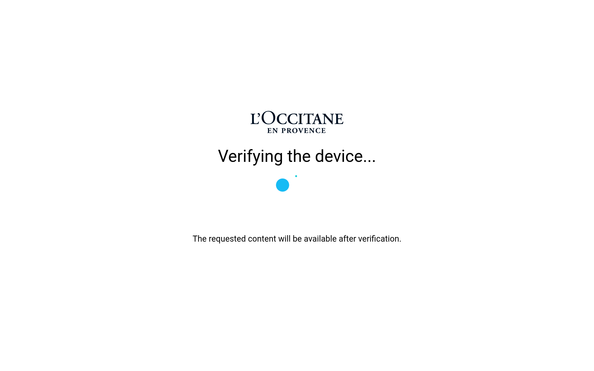
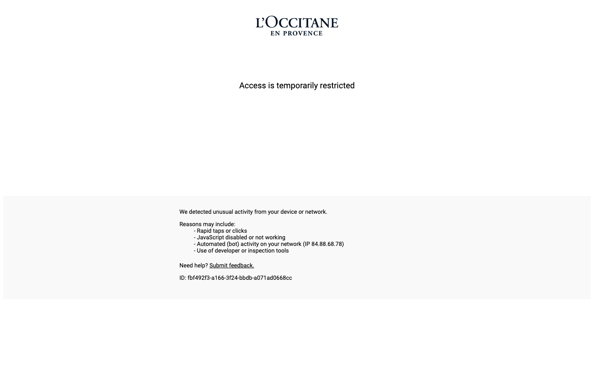

# loccitane Design System

You are building UI for **loccitane**. Dark-themed, neutral palette, serif typography (Times), standard density on a 8px grid, flat elevation (no shadows).

## Visual Reference

**IMPORTANT**: Study ALL screenshots below before writing any UI. Match colors, typography, spacing, layout, and motion exactly as shown.

### Homepage



### Scroll Journey (Cinematic Visual States)

> These screenshots capture the website at different scroll depths. The design changes dramatically as you scroll — each frame shows a different cinematic state. Replicate these exact visual transitions.

#### 0% — Hero / Above the fold


#### 17% — Mid-page at 17% scroll


#### 33% — Mid-page at 33% scroll


#### 50% — Mid-page at 50% scroll


#### 67% — Mid-page at 67% scroll


#### 83% — Mid-page at 83% scroll


#### 100% — Footer / End of page


> Read `references/DESIGN.md` for full token details. Read `references/ANIMATIONS.md` for motion specs. Read `references/LAYOUT.md` for layout structure. Read `references/COMPONENTS.md` for component patterns.

## Ultra Reference Files

This package includes extended documentation. **Read these files before implementing:**

| File | Contents |
|------|----------|
| `references/DESIGN.md` | Full design system tokens, colors, typography, spacing |
| `references/VISUAL_GUIDE.md` | **START HERE** — Master visual guide with all screenshots embedded |
| `references/ANIMATIONS.md` | CSS keyframes, scroll triggers, motion library stack, video specs |
| `references/LAYOUT.md` | Flex/grid containers, page structure, spacing relationships |
| `references/COMPONENTS.md` | DOM component patterns, HTML structure, class fingerprints |
| `references/INTERACTIONS.md` | Hover/focus states with before/after style diffs |
| `screens/scroll/` | 7 scroll journey screenshots showing cinematic states |

## Design Philosophy

- **Flat elevation** — depth through color shifts and borders, never shadows. Surfaces get progressively lighter to indicate elevation.
- **Solid colors only** — no gradients anywhere. Every surface is a single flat color.
- **Single typeface** — Times carries all text. Hierarchy comes from size, weight, and color — never font mixing.
- **standard density** — 8px base grid. Every dimension is a multiple of 8.
- **neutral palette** — the color temperature runs neutral, matching the serif typography.
- **Minimal motion** — prefer instant state changes. Only use transitions for loading and page transitions.

## Color System

### Core Palette

| Role | Token | Hex | Use |
|------|-------|-----|-----|
| Background | `--background` | `#000000` | Page/app background |

## Typography

### Font Stack

- **Times** — Heading 1, Heading 2, Heading 3, Body, Caption

### Type Scale

| Role | Family | Size | Weight |
|------|--------|------|--------|
| Heading 1 | Times | 48px / 3rem | 700 |
| Heading 2 | Times | 32px / 2rem | 600 |
| Heading 3 | Times | 24px / 1.5rem | 600 |
| Body | Times | 16px / 1rem | 400 |
| Caption | Times | 12px / 0.75rem | 400 |

### Typography Rules

- All text uses **Times** — never add another font family
- Max 3-4 font sizes per screen
- Headings: weight 600-700, body: weight 400
- Use color and opacity for text hierarchy, not additional font sizes
- Line height: 1.5 for body, 1.2 for headings

## Spacing & Layout

### Base Grid: 8px

Every dimension (margin, padding, gap, width, height) must be a multiple of **8px**.

### Spacing Scale

`8, 16, 24, 32, 40, 48, 56, 64, 72, 80, 88, 96` px

### Spacing as Meaning

| Spacing | Use |
|---------|-----|
| 4-8px | Tight: related items within a group |
| 16px | Medium: between groups |
| 24-32px | Wide: between sections |
| 48px+ | Vast: major section breaks |

### Border Radius

Scale: `8px`
Default: `8px`

## Component Patterns

### Card

```css
.card {
  background: #000000;
  border-radius: 8px;
  padding: 32px;
}
```

```html
<div class="card">
  <h3>Card Title</h3>
  <p>Card content goes here.</p>
</div>
```

### Button

```css
/* Primary */
.btn-primary {
  background: #444444;
  color: #444444;
  border-radius: 8px;
  padding: 16px 32px;
  font-weight: 500;
  transition: opacity 150ms ease;
}
.btn-primary:hover { opacity: 0.9; }

/* Ghost */
.btn-ghost {
  background: transparent;
  border: 1px solid #444444;
  color: #444444;
  border-radius: 8px;
  padding: 16px 32px;
}
```

```html
<button class="btn-primary">Get Started</button>
<button class="btn-ghost">Learn More</button>
```

### Input

```css
.input {
  background: #000000;
  border: 1px solid #444444;
  border-radius: 8px;
  padding: 16px 24px;
  color: #444444;
  font-size: 14px;
}
.input:focus { border-color: var(--accent); outline: none; }
```

```html
<input class="input" type="text" placeholder="Search..." />
```

### Badge / Chip

```css
.badge {
  display: inline-flex;
  align-items: center;
  padding: 8px 16px;
  border-radius: 9999px;
  font-size: 12px;
  font-weight: 500;
  background: #000000;
  color: #888888;
}
```

```html
<span class="badge">New</span>
<span class="badge">Beta</span>
```

### Modal / Dialog

```css
.modal-backdrop { background: rgba(0, 0, 0, 0.6); }
.modal {
  background: #000000;
  border-radius: 8px;
  padding: 32px;
  max-width: 480px;
  width: 90vw;
}
```

```html
<div class="modal-backdrop">
  <div class="modal">
    <h2>Dialog Title</h2>
    <p>Dialog content.</p>
    <button class="btn-primary">Confirm</button>
    <button class="btn-ghost">Cancel</button>
  </div>
</div>
```

### Table

```css
.table { width: 100%; border-collapse: collapse; }
.table th {
  text-align: left;
  padding: 16px 24px;
  font-weight: 500;
  font-size: 12px;
  color: #888888;
  text-transform: uppercase;
  letter-spacing: 0.05em;
  border-bottom: 1px solid #444444;
}
.table td {
  padding: 24px;
  border-bottom: 1px solid #444444;
}
```

```html
<table class="table">
  <thead><tr><th>Name</th><th>Status</th><th>Date</th></tr></thead>
  <tbody>
    <tr><td>Item One</td><td>Active</td><td>Jan 1</td></tr>
    <tr><td>Item Two</td><td>Pending</td><td>Jan 2</td></tr>
  </tbody>
</table>
```

### Navigation

```css
.nav {
  display: flex;
  align-items: center;
  gap: 16px;
  padding: 24px 32px;
}
.nav-link {
  color: #888888;
  padding: 16px 24px;
  border-radius: 8px;
  transition: color 150ms;
}
```

```html
<nav class="nav">
  <a href="/" class="nav-link active">Home</a>
  <a href="/about" class="nav-link">About</a>
  <a href="/pricing" class="nav-link">Pricing</a>
  <button class="btn-primary" style="margin-left: auto">Get Started</button>
</nav>
```

## Animation & Motion

This project uses **subtle motion**. Transitions smooth state changes without calling attention.

### Motion Guidelines

- **Duration:** 150-300ms for micro-interactions, 300-500ms for page transitions
- **Easing:** `ease-out` for enters, `ease-in` for exits
- **Direction:** Elements enter from bottom/right, exit to top/left
- **Reduced motion:** Always respect `prefers-reduced-motion` — disable animations when set

## Depth & Elevation

This design uses **flat elevation** — no box-shadows anywhere.

### Elevation Strategy

| Level | Technique | Use |
|-------|-----------|-----|
| 0 — Base | Background color | Page background |
| 1 — Raised | Lighter surface + subtle border | Cards, panels |
| 2 — Floating | Even lighter surface + stronger border | Dropdowns, popovers |
| 3 — Overlay | Backdrop + modal surface | Modals, dialogs |

## Anti-Patterns (Never Do)

- **No box-shadow** on any element — use borders and surface colors for depth
- **No gradients** — solid colors only, everywhere
- **No blur effects** — no backdrop-blur, no filter: blur()
- **No zebra striping** — tables and lists use borders for separation
- **No invented colors** — every hex value must come from the palette above
- **No arbitrary spacing** — every dimension is a multiple of 8px
- **No extra fonts** — only Times are allowed
- **No arbitrary border-radius** — use the scale: 8px
- **No opacity for disabled states** — use muted colors instead
- **No pill shapes** — this design doesn't use rounded-full / 9999px radius

## Workflow

1. **Read** `references/DESIGN.md` before writing any UI code
2. **Pick colors** from the Color System section — never invent new ones
3. **Set typography** — Times only, using the type scale
4. **Build layout** on the 8px grid — check every margin, padding, gap
5. **Match components** to patterns above before creating new ones
6. **Apply elevation** — flat, surface color shifts only
7. **Validate** — every value traces back to a design token. No magic numbers.

## Brand Spec

- **Site URL:** `https://es.loccitane.com`
- **Brand typeface:** Times

## Quick Reference

```
Background:     #000000
Surface:        (not extracted)
Text:           (not extracted) / (not extracted)
Accent:         (not extracted)
Border:         (not extracted)
Font:           Times
Spacing:        8px grid
Radius:         8px
Components:     0 detected
```

## When to Trigger

Activate this skill when:
- Creating new components, pages, or visual elements for loccitane
- Writing CSS, Tailwind classes, styled-components, or inline styles
- Building page layouts, templates, or responsive designs
- Reviewing UI code for design consistency
- The user mentions "loccitane" design, style, UI, or theme
- Generating mockups, wireframes, or visual prototypes

---

# Full Reference Files

> Every output file is embedded below. Claude has full design system context from /skills alone.

## Design System Tokens (DESIGN.md)

# loccitane DESIGN.md

> Auto-generated design system — reverse-engineered via static analysis by skillui.
> Frameworks: None detected
> Colors: 1 · Fonts: 1 · Components: 0
> Icon library: not detected · State: not detected
> Primary theme: dark · Dark mode toggle: no · Motion: none

## Visual Reference

**Match this design exactly** — study colors, fonts, spacing, and component shapes before writing any UI code.


---

## 1. Visual Theme & Atmosphere

This is a **dark-themed** interface with a flat, neutral visual language. Elevation is achieved through color and border shifts rather than shadows — a clean, industrial aesthetic. Typography uses **Times** throughout — a editorial, refined choice that maintains consistency. Spacing follows a **8px base grid** (standard density), with scale: 8, 16, 24, 32, 40, 48, 56, 64px.

---

## 2. Color Palette & Roles

| Token | Hex | Role | Use |
|---|---|---|---|
| background | `#000000` | background | Page background, darkest surface |


---

## 3. Typography Rules

**Font Stack:**
- **Times** — Heading 1, Heading 2, Heading 3, Body, Caption

| Role | Font | Size | Weight |
|---|---|---|---|
| Heading 1 | Times | 48px / 3rem | 700 |
| Heading 2 | Times | 32px / 2rem | 600 |
| Heading 3 | Times | 24px / 1.5rem | 600 |
| Body | Times | 16px / 1rem | 400 |
| Caption | Times | 12px / 0.75rem | 400 |

**Typographic Rules:**
- Use **Times** for all text — do not mix font families
- Maintain consistent hierarchy: no more than 3-4 font sizes per screen
- Headings use bold (600-700), body uses regular (400)
- Line height: 1.5 for body text, 1.2 for headings
- Use color and opacity for secondary hierarchy, not additional font sizes


---

## 4. Component Stylings

No components detected. Scan `src/components/` or `components/` to populate this section.

---

## 5. Layout Principles

- **Base spacing unit:** 8px
- **Spacing scale:** 8, 16, 24, 32, 40, 48, 56, 64, 72, 80, 88, 96
- **Border radius:** 8px

**Spacing as Meaning:**
| Spacing | Use |
|---|---|
| 4-8px | Tight: related items within a group |
| 16px | Medium: between groups |
| 24-32px | Wide: between sections |
| 48px+ | Vast: major section breaks |


---

## 6. Depth & Elevation

No box-shadow values detected. The design uses a **flat visual style** — elevation is conveyed through background color shifts and borders rather than shadows.

**Elevation Strategy:**
| Level | Technique | Use |
|---|---|---|
| 0 — Base | Background color | Page background |
| 1 — Raised | Lighter surface + subtle border | Cards, panels |
| 2 — Floating | Even lighter surface + stronger border | Dropdowns, popovers |
| 3 — Overlay | Backdrop + modal surface | Modals, dialogs |


---

## 8. Do's and Don'ts

### Do's

- Use `#000000` as the primary page background
- Use **Times** for all UI text
- Follow the **8px** spacing grid for all margins, padding, and gaps
- Use border and background shifts for elevation — not shadows
- Use border-radius from the scale: 8px

### Don'ts

- Don't introduce colors outside this palette — extend the design tokens first
- Don't mix font families — use Times consistently
- Don't use arbitrary spacing values — stick to multiples of 8px
- Don't add box-shadow — this design system uses flat elevation
- Don't use gradients — the design uses solid colors only
- Don't use arbitrary border-radius values — pick from the defined scale
- Don't use backdrop-blur or blur effects

### Anti-Patterns (detected from codebase)

- No box-shadow on any element
- No gradient backgrounds
- No blur or backdrop-blur effects
- No zebra striping on tables/lists


---

## 9. Responsive Behavior

No breakpoints detected. Consider adding responsive breakpoints to the design system.

---

## 10. Agent Prompt Guide

Use these as starting points when building new UI:

### Build a Card

```
Background: #000000
Border: 1px solid var(--border)
Radius: 8px
Padding: 32px
Font: Times
No shadows — use borders and surface colors for depth.
```

### Build a Button

```
Primary: bg var(--accent), text white
Ghost: bg transparent, border var(--border)
Padding: 16px 32px
Radius: 8px
Hover: opacity 0.9 or lighter shade
Focus: ring with var(--accent)
```

### Build a Page Layout

```
Background: #000000
Max-width: 1280px, centered
Grid: 8px base
Responsive: mobile-first, breakpoints from Section 9
```

### Build a Stats Card

```
Surface: #000000
Label: var(--text-muted) (muted, 12px, uppercase)
Value: var(--text-primary) (primary, 24-32px, bold)
Status: use success/warning/danger from Section 2
```

### Build a Form

```
Input bg: #000000
Input border: 1px solid var(--border)
Focus: border-color var(--accent)
Label: var(--text-muted) 12px
Spacing: 32px between fields
Radius: 8px
```

### General Component

```
1. Read DESIGN.md Sections 2-6 for tokens
2. Colors: only from palette
3. Font: Times, type scale from Section 3
4. Spacing: 8px grid
5. Components: match patterns from Section 4
6. Elevation: flat, surface shifts
```

## Visual Guide — Screenshots (VISUAL_GUIDE.md)

# loccitane — Visual Guide

> Master visual reference. Study every screenshot carefully before implementing any UI.
> Match colors, layout, typography, spacing, and motion states exactly.

## Scroll Journey

The page has cinematic scroll animations. Each screenshot below shows the exact visual state at that scroll depth.
**Replicate these transitions precisely** — the design changes dramatically as you scroll.

### Hero — Above the fold

*Scroll position: 0px of 916px total*


### 17% scroll depth

*Scroll position: 3px of 916px total*


### 33% scroll depth

*Scroll position: 5px of 916px total*


### 50% scroll depth

*Scroll position: 8px of 916px total*


### 67% scroll depth

*Scroll position: 11px of 916px total*


### 83% scroll depth

*Scroll position: 13px of 916px total*


### Footer — End of page

*Scroll position: 16px of 916px total*


## Full Page Screenshots

### home

*URL: `https://es.loccitane.com`*


## Animations & Motion (ANIMATIONS.md)

# Animation Reference

> Cinematic motion design extracted from live DOM. Follow these specs exactly to recreate the experience.

## Motion Technology Stack

Pure CSS animations — no external animation libraries detected.

## Scroll Journey

The page is **916px** tall. Each frame below shows what the user sees at that scroll depth.

> **Use these screenshots to understand WHAT animates, WHEN it animates, and HOW it moves.**

### 0% — Top / Hero
Scroll position: 0px


### 17% — Opening Section
Scroll position: 3px


### 33% — First Feature Section
Scroll position: 5px


### 50% — Mid-Page
Scroll position: 8px


### 67% — Lower Content
Scroll position: 11px


### 83% — Near Footer
Scroll position: 13px


### 100% — Bottom / Footer
Scroll position: 16px


## CSS Keyframes (1 extracted)

### `@keyframes A`

Duration: `1.5s` · Easing: `ease` · Delay: `0s` · Iteration: `1` · Fill: `none`

Used by: `#cmsg`

```css
@keyframes A {
  0% {
    opacity: 0;
  }
  99% {
    opacity: 0;
  }
  100% {
    opacity: 1;
  }
}
```

> Opacity fade

## How to Recreate This Motion Design

### Step 2 — Scroll-Reveal Pattern

Elements that animate into view follow this pattern:

```css
/* Initial hidden state */
.reveal {
  opacity: 0;
  transform: translateY(40px);
  transition: opacity 0.6s cubic-bezier(0.4, 0, 0.2, 1),
              transform 0.6s cubic-bezier(0.4, 0, 0.2, 1);
}
.reveal.visible {
  opacity: 1;
  transform: translateY(0);
}
```

### Step 3 — Key Motion Principles

- **Always add** `@media (prefers-reduced-motion: reduce) { * { animation-duration: 0.01ms !important; transition-duration: 0.01ms !important; } }`

### Step 4 — Scroll Journey Reference

Match what happens at each scroll position:

- **0%** (`0px`) → `screens/scroll/scroll-000.png`
- **17%** (`3px`) → `screens/scroll/scroll-017.png`
- **33%** (`5px`) → `screens/scroll/scroll-033.png`
- **50%** (`8px`) → `screens/scroll/scroll-050.png`
- **67%** (`11px`) → `screens/scroll/scroll-067.png`
- **83%** (`13px`) → `screens/scroll/scroll-083.png`
- **100%** (`16px`) → `screens/scroll/scroll-100.png`

## Layout & Grid (LAYOUT.md)

# Layout Reference

> Auto-extracted from live DOM. Use this to understand how the site is structured spatially.

No layout data extracted (Playwright required).

## Component Patterns (COMPONENTS.md)

# Component Reference

> Repeated DOM patterns detected by structural analysis. Each component appeared 3+ times.

No repeated components detected (Playwright required).

## Interactions & States (INTERACTIONS.md)

# Interaction Reference

> Micro-interactions extracted from live DOM. Recreate these exactly for authentic feel.

No interaction data extracted (Playwright required).

## Design Tokens — JSON Files

### tokens/colors.json
```json
{
  "$schema": "https://design-tokens.github.io/community-group/format/",
  "core": {
    "background": {
      "value": "#000000",
      "role": "background"
    }
  },
  "status": {},
  "extended": {},
  "meta": {
    "theme": "dark",
    "extracted": "2026-09-15"
  }
}
```

### tokens/spacing.json
```json
{
  "base": {
    "value": "8px",
    "description": "Grid unit — all spacing must be multiples of this"
  },
  "unit": "px",
  "scale": {
    "xs": {
      "value": "8px",
      "px": 8
    },
    "sm": {
      "value": "16px",
      "px": 16
    },
    "md": {
      "value": "24px",
      "px": 24
    },
    "lg": {
      "value": "32px",
      "px": 32
    },
    "xl": {
      "value": "40px",
      "px": 40
    },
    "2xl": {
      "value": "48px",
      "px": 48
    },
    "3xl": {
      "value": "56px",
      "px": 56
    },
    "4xl": {
      "value": "64px",
      "px": 64
    },
    "5xl": {
      "value": "72px",
      "px": 72
    },
    "6xl": {
      "value": "80px",
      "px": 80
    }
  },
  "multipliers": {
    "1x": {
      "value": "8px",
      "raw": 8
    },
    "2x": {
      "value": "16px",
      "raw": 16
    },
    "3x": {
      "value": "24px",
      "raw": 24
    },
    "4x": {
      "value": "32px",
      "raw": 32
    },
    "5x": {
      "value": "40px",
      "raw": 40
    },
    "6x": {
      "value": "48px",
      "raw": 48
    },
    "7x": {
      "value": "56px",
      "raw": 56
    },
    "8x": {
      "value": "64px",
      "raw": 64
    },
    "9x": {
      "value": "72px",
      "raw": 72
    },
    "10x": {
      "value": "80px",
      "raw": 80
    },
    "11x": {
      "value": "88px",
      "raw": 88
    },
    "12x": {
      "value": "96px",
      "raw": 96
    },
    "13x": {
      "value": "104px",
      "raw": 104
    },
    "14x": {
      "value": "112px",
      "raw": 112
    },
    "15x": {
      "value": "120px",
      "raw": 120
    },
    "16x": {
      "value": "128px",
      "raw": 128
    }
  },
  "meta": {
    "totalValues": 15,
    "min": 8,
    "max": 120
  }
}
```

### tokens/typography.json
```json
{
  "families": [
    "Times"
  ],
  "scale": {
    "heading-1": {
      "fontFamily": "Times",
      "fontSize": "48px / 3rem",
      "fontWeight": "700",
      "lineHeight": null,
      "source": "computed"
    },
    "heading-2": {
      "fontFamily": "Times",
      "fontSize": "32px / 2rem",
      "fontWeight": "600",
      "lineHeight": null,
      "source": "computed"
    },
    "heading-3": {
      "fontFamily": "Times",
      "fontSize": "24px / 1.5rem",
      "fontWeight": "600",
      "lineHeight": null,
      "source": "computed"
    },
    "body": {
      "fontFamily": "Times",
      "fontSize": "16px / 1rem",
      "fontWeight": "400",
      "lineHeight": null,
      "source": "computed"
    },
    "caption": {
      "fontFamily": "Times",
      "fontSize": "12px / 0.75rem",
      "fontWeight": "400",
      "lineHeight": null,
      "source": "computed"
    }
  },
  "fontFaces": [],
  "rules": {
    "maxSizesPerScreen": 4,
    "headingWeightRange": "600-700",
    "bodyWeight": 400,
    "lineHeightBody": 1.5,
    "lineHeightHeading": 1.2
  }
}
```

## Screenshots Inventory (screens/)

> Study all screenshots carefully before implementing any UI. Match every visual detail exactly.

### Scroll Journey (screens/scroll/)

*Cinematic scroll states — page visual at each scroll depth*


### Full Page Screenshots (screens/pages/)

*Full-page screenshots of each crawled URL*



### Screenshot Index (screens/INDEX.md)

# Screenshot Index

## Scroll Journey

> Shows the cinematic state at each point of the page

| Scroll | Y Position | File |
|--------|-----------|------|
| 0% | 0px | `screens/scroll/scroll-000.png` |
| 17% | 3px | `screens/scroll/scroll-017.png` |
| 33% | 5px | `screens/scroll/scroll-033.png` |
| 50% | 8px | `screens/scroll/scroll-050.png` |
| 67% | 11px | `screens/scroll/scroll-067.png` |
| 83% | 13px | `screens/scroll/scroll-083.png` |
| 100% | 16px | `screens/scroll/scroll-100.png` |

## Pages

| Page | URL | File |
|------|-----|------|
| home | `https://es.loccitane.com` | `screens/pages/home.png` |

## Homepage Screenshots (screenshots/)


