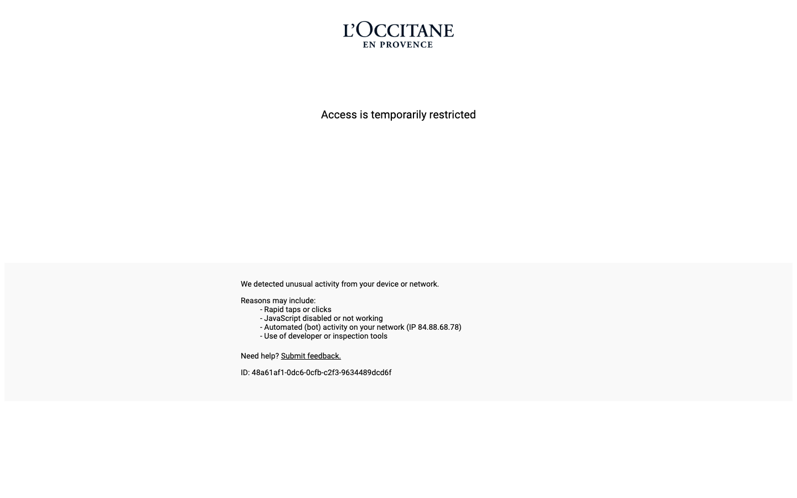
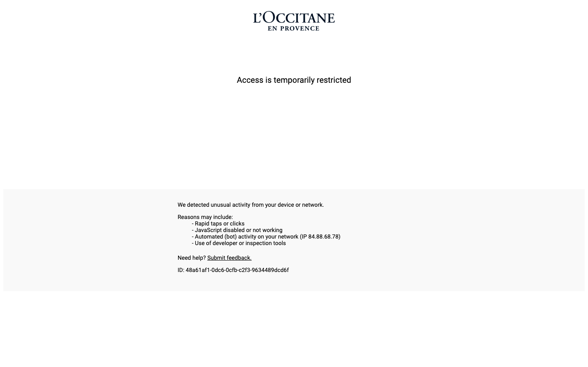
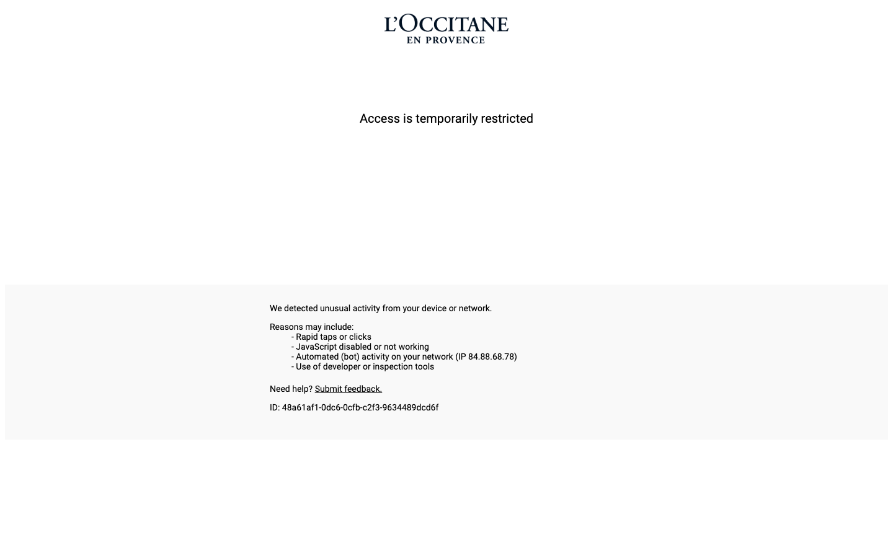

# Animation Reference

> Cinematic motion design extracted from live DOM. Follow these specs exactly to recreate the experience.

## Motion Technology Stack

Pure CSS animations — no external animation libraries detected.

## Scroll Journey

The page is **916px** tall. Each frame below shows what the user sees at that scroll depth.

> **Use these screenshots to understand WHAT animates, WHEN it animates, and HOW it moves.**

### 0% — Top / Hero
Scroll position: 0px



### 17% — Opening Section
Scroll position: 3px


### 33% — First Feature Section
Scroll position: 5px


### 50% — Mid-Page
Scroll position: 8px


### 67% — Lower Content
Scroll position: 11px



### 83% — Near Footer
Scroll position: 13px


### 100% — Bottom / Footer
Scroll position: 16px



## CSS Keyframes (1 extracted)

### `@keyframes A`

Duration: `1.5s` · Easing: `ease` · Delay: `0s` · Iteration: `1` · Fill: `none`

Used by: `#cmsg`

```css
@keyframes A {
  0% {
    opacity: 0;
  }
  99% {
    opacity: 0;
  }
  100% {
    opacity: 1;
  }
}
```

> Opacity fade

## How to Recreate This Motion Design

### Step 2 — Scroll-Reveal Pattern

Elements that animate into view follow this pattern:

```css
/* Initial hidden state */
.reveal {
  opacity: 0;
  transform: translateY(40px);
  transition: opacity 0.6s cubic-bezier(0.4, 0, 0.2, 1),
              transform 0.6s cubic-bezier(0.4, 0, 0.2, 1);
}
.reveal.visible {
  opacity: 1;
  transform: translateY(0);
}
```

### Step 3 — Key Motion Principles

- **Always add** `@media (prefers-reduced-motion: reduce) { * { animation-duration: 0.01ms !important; transition-duration: 0.01ms !important; } }`

### Step 4 — Scroll Journey Reference

Match what happens at each scroll position:

- **0%** (`0px`) → `screens/scroll/scroll-000.png`
- **17%** (`3px`) → `screens/scroll/scroll-017.png`
- **33%** (`5px`) → `screens/scroll/scroll-033.png`
- **50%** (`8px`) → `screens/scroll/scroll-050.png`
- **67%** (`11px`) → `screens/scroll/scroll-067.png`
- **83%** (`13px`) → `screens/scroll/scroll-083.png`
- **100%** (`16px`) → `screens/scroll/scroll-100.png`

